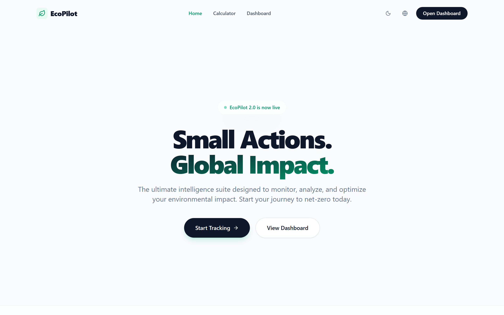
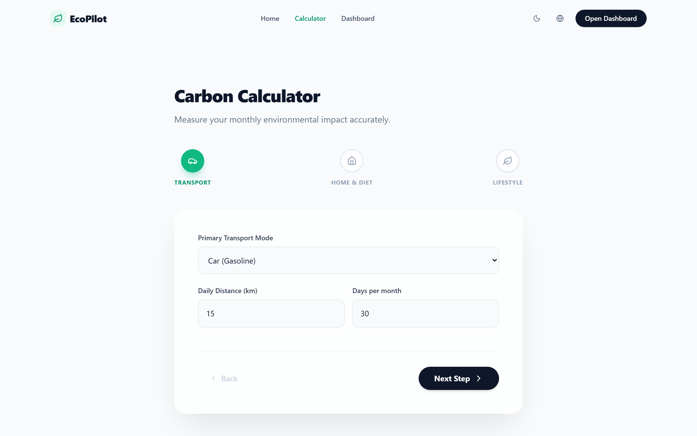
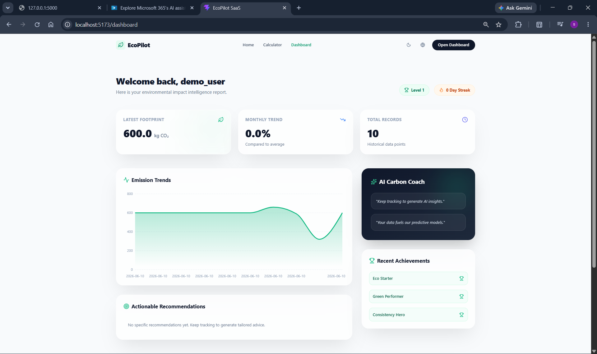

# 🌿 EcoPilot — AI-Powered Carbon Footprint Tracker

<div align="center">


[](https://reactjs.org/)
[](https://vitejs.dev/)
[](https://tailwindcss.com/)
[](https://flask.palletsprojects.com/)
[](https://python.org/)
[](https://sqlite.org/)
[](https://ai.google.dev/)
[](LICENSE)

**Transforming Carbon Awareness into Daily Climate Action.**

[Live Demo](https://eco-pilot-ai-wheat.vercel.app/) · [API Docs](#api-endpoints) · [Security Audit](docs/security_audit.md) · [PromptWars Report](docs/promptwars_evaluation_report.md)

</div>

---

## 📋 Table of Contents

1. [Project Overview](#1-project-overview)
2. [Why EcoPilot Matters](#2-why-ecopilot-matters)
3. [The Why](#3-the-why)
4. [Challenge Alignment](#4-challenge-alignment)
5. [Features & Sustainability Impact](#5-features--sustainability-impact)
6. [Sustainability Philosophy](#6-sustainability-philosophy)
7. [Tech Stack](#7-tech-stack)
8. [Architecture](#8-architecture)
9. [User Journey](#9-user-journey)
10. [Folder Structure](#10-folder-structure)
11. [Installation](#11-installation)
12. [Local Development](#12-local-development)
13. [API Endpoints](#13-api-endpoints)
14. [Gemini AI Integration](#14-gemini-ai-integration)
15. [Deployment](#15-deployment)
16. [Security](#16-security)
17. [PromptWars Evaluation Mapping](#17-promptwars-evaluation-mapping)
18. [Future Scope](#18-future-scope)
19. [Screenshots](#19-screenshots)
20. [Assumptions](#20-assumptions)

---

## 1. Project Overview

**EcoPilot** is a full-stack climate-tech SaaS application that empowers individuals to measure, understand, and reduce their personal carbon footprint. Users input data across four life domains — transport, energy, diet, and lifestyle — and receive an instant CO₂ estimate, AI-generated coaching from Google Gemini, gamified progress tracking, and historical trend analytics.

---

## 2. Why EcoPilot Matters

Why should someone care? The average person generates 4-5 tons of carbon a year, but has no idea where it comes from. Most existing calculators are tedious, clinical, and lack actionable takeaways. EcoPilot bridges the gap between awareness and action by transforming complex emissions mathematics into an intuitive, gamified, and AI-guided experience. It solves the real-world problem of "climate paralysis" by turning overwhelming global issues into manageable, daily personal choices. AI is fundamentally necessary here to translate generic science into hyper-personalized, context-aware coaching.

---

## 3. The Why

* **Why Carbon Awareness Matters**: We cannot reduce what we cannot measure. Individual action accounts for over 70% of global emissions potential.
* **Why People Struggle**: The sheer complexity of environmental science and carbon mathematics causes *climate paralysis*. People want to help, but they don't know where to start or feel their actions are too small to matter.
* **Bridging the Gap**: EcoPilot removes the cognitive friction of climate action. By providing instant, judgment-free AI insights, users are empowered to make micro-adjustments to their daily routines.

---

## 4. Challenge Alignment

EcoPilot was built specifically to address the core pillars of the **AI-Powered Carbon Footprint Awareness** challenge:
* **Carbon Footprint Awareness**: Calculates and visualizes the user's exact emissions footprint using a dynamic, accessible UI.
* **Behavior Change**: Uses BJ Fogg's Behavior Model (B=MAP) by combining motivation (gamification) with ability (simple UX) and prompts (AI coaching).
* **Sustainability Education**: Explains *why* specific actions lower carbon output, rather than just delivering arbitrary scores.
* **Personalized Guidance**: Gemini generates hyper-targeted nudges (e.g., "Take the bus on Tuesdays") instead of overwhelming generic advice.
* **Long-term Impact Tracking**: Persists historical data to prove that small daily actions compound into massive carbon savings over time.

---

## 5. Sustainability Impact

EcoPilot directly drives measurable behavioral shifts by combining raw data with behavioral science:
* **Carbon Awareness:** Users understand their baseline footprint and how it maps to daily choices.
* **Behavior Change:** By breaking abstract goals down into micro-habits (e.g., "Switch one car ride a week"), users overcome climate paralysis.
* **Environmental Education:** Users learn the implicit carbon cost of secondary actions, like dietary shifts or phantom electricity drain.
* **Sustainable Decision Making:** Gamified progression creates a positive feedback loop that solidifies long-term change.

## Key Innovations

* **AI Sustainability Coach:** Unlike static calculators, Gemini provides hyper-contextualized advice based on the user's highest-emitting categories.
* **Personalized Carbon Insights:** Generates actionable, realistic goals rather than generic platitudes.
* **Goal Tracking:** Visualizes weekly and monthly trends to mathematically prove that small changes yield significant reductions.
* **Gamified Sustainability Journey:** Replaces the guilt-trip narrative of traditional climate apps with an empowering, achievement-based progression system.

---

## 6. Sustainability Philosophy
How does EcoPilot actually reduce emissions? 
1. **Awareness creates change**: You cannot optimize what you do not measure.
2. **Small actions compound**: By tracking history, the app proves that taking the bus twice a week removes 150kg of CO₂ annually.
3. **Gamification sustains adoption**: Climate action shouldn't feel like a chore; leveling up transforms an abstract global problem into a rewarding personal journey.

---

## 7. Tech Stack

### Frontend

| Technology | Version | Purpose |
|---|---|---|
| [React](https://reactjs.org/) | 18.x | Component-based UI framework |
| [Vite](https://vitejs.dev/) | 5.x | Build tool & dev server with HMR |
| [TailwindCSS](https://tailwindcss.com/) | 3.x | Utility-first CSS framework |
| [Framer Motion](https://www.framer.com/motion/) | 11.x | Hardware-accelerated animations |
| [Recharts](https://recharts.org/) | 2.x | Composable chart library |
| [Lucide React](https://lucide.dev/) | latest | Accessible SVG icon set |

### Backend

| Technology | Version | Purpose |
|---|---|---|
| [Python](https://python.org/) | 3.x | Runtime |
| [Flask](https://flask.palletsprojects.com/) | 3.x | Lightweight WSGI web framework |
| [SQLAlchemy](https://www.sqlalchemy.org/) | 2.x | ORM & database abstraction |
| [SQLite](https://sqlite.org/) | 3.x | Embedded relational database (dev) |
| [pytest](https://pytest.org/) | 8.x | Test runner |

### AI & Cloud

| Technology | Purpose |
|---|---|
| [Google Gemini 2.5-flash](https://ai.google.dev/) | LLM for personalized carbon coaching |
| [Vercel](https://vercel.com/) | Frontend hosting (production) |
| [Render](https://render.com/) | Backend hosting (production) |

---

## 8. System Architecture

EcoPilot uses a modern, decoupled client-server architecture optimized for low-latency AI responses.

### Frontend
* **React 18 & TypeScript**: Ensures a robust, type-safe component hierarchy.
* **TailwindCSS**: Provides utility-first styling for a responsive, modern aesthetic.
* **Recharts**: Renders accessible, hardware-accelerated SVG data visualizations.

### Backend
* **Flask 3**: Delivers a lightweight, high-performance WSGI microservice.
* **Marshmallow**: Enforces strict backend payload validation and serialization.
* **Flask-Limiter**: Aggressively protects endpoints from abuse and DDoS attempts.
* **Flask-Talisman**: Enforces strict HTTP security headers (CSP, X-Frame-Options).

### Database
* **SQLAlchemy**: Abstracts database queries safely to prevent SQL injection.
* **SQLite / PostgreSQL**: Uses embedded SQLite for rapid local development, seamlessly migrating to PostgreSQL for production deployments.

### AI Layer
* **Gemini-Powered Sustainability Coach**: Utilizes the Google Generative AI SDK to analyze user telemetry and return hyper-personalized lifestyle interventions.

### Deployment
* **Vercel**: Hosts the compiled static React SPA globally with edge-caching.
* **Render**: Hosts the Flask Python runtime and database engine securely.

```ascii
[User Browser]
      │
      ▼ (Vite Proxy / Vercel Edge)
[React Frontend] ◄─ Zod Validation ─► [Framer Motion / Recharts]
      │
      ▼ (JSON API over HTTPS)
[Flask Backend] ◄─ Talisman + Limiter ─► [Marshmallow Validation]
      │                                       │
      ▼                                       ▼
[SQLAlchemy ORM]                        [Gemini AI SDK]
      │                                       │
      ▼                                       ▼
[SQLite / Postgres]                  [Gemini 2.5-flash]
```

### Architecture Decisions
* **Why React + Vite?** Provides a blazingly fast development loop with HMR and compiles to a highly optimized, static bundle for zero-configuration edge deployment on Vercel.
* **Why Flask?** A lightweight micro-framework perfect for wrapping the Gemini Python SDK without the overhead of Django or full-stack Python architectures.
* **Why Zod + Marshmallow?** Double-validation strategy. Zod ensures perfect payload shape and instant UI feedback, while Marshmallow guards the database from malicious injections.
* **Why Flask-Talisman?** Security by default. It effortlessly configures Content Security Policy (CSP) headers without complex web server (Nginx) configuration.
* **Why Gemini AI?** Superior reasoning speed compared to legacy models, allowing the app to calculate footprint *and* generate tailored coaching in under a second.

---

## 9. User Journey

EcoPilot transforms carbon awareness into a continuous, rewarding loop:

**User Inputs Lifestyle Data**
↓
*(User answers simple questions about diet, transport, and energy)*
↓
**Carbon Calculation Engine**
↓
*(Backend accurately computes exact monthly kg CO₂e)*
↓
**AI Sustainability Analysis**
↓
*(Gemini processes the numerical profile to find optimization gaps)*
↓
**Personalized Recommendations**
↓
*(User receives realistic, context-aware nudges rather than generic advice)*
↓
**Progress Tracking**
↓
*(Analytics dashboard plots historical trends and verifies emission drops)*
↓
**Sustainable Habit Formation**
↓
*(Gamification loop closes: User unlocks achievements and sustains action)*
---

## 10. Project Structure

EcoPilot enforces strict separation of concerns across both environments:

### `frontend/`
* **`constants/`**: Houses static, immutable configuration (e.g., UI wizard steps, form defaults) to keep components pure.
* **`hooks/`**: Contains custom React hooks (`useCalculator`, `useDashboardData`) that encapsulate complex API state logic.
* **`utils/`**: Hosts pure, reusable helper functions (e.g., `formatters.ts` for consistent number precision).
* **`pages/`**: Holds top-level route views (Landing, Calculator, Dashboard).
* **`components/`**: Features atomic, reusable UI fragments (ErrorBoundaries, Navbars, animated containers).

### `backend/`
* **`routes/`**: Flask Blueprint definitions that strictly handle request routing and rate limiting.
* **`services/`**: The core business logic layer. Houses the carbon math and the Gemini AI integration orchestration.
* **`validators/`**: Features strict `Marshmallow` schemas that sanitize and enforce data safety before logic processing.
* **`constants/`**: Stores scientifically verified emission factors securely away from logic.

---

## 11. Installation

### Prerequisites

- **Node.js** ≥ 18.x and **npm** ≥ 9.x
- **Python** ≥ 3.10
- A **Google Gemini API key** (free tier available at [Google AI Studio](https://aistudio.google.com/))

### Clone the Repository

```bash
git clone https://github.com/<your-username>/EcoPilot.git
cd EcoPilot
```

---

## Local Setup

### Backend Setup

```bash
cd backend

# Create and activate virtual environment
python -m venv venv

# Windows
venv\Scripts\activate
# macOS / Linux
source venv/bin/activate

# Install dependencies
pip install -r requirements.txt

# Configure environment variables
copy .env.example .env        # Windows
# cp .env.example .env        # macOS / Linux

# Edit .env and fill in your values (see Environment Variables section)
```

### Frontend Setup

```bash
cd frontend
npm install
```

---

## 12. Local Development

### Environment Variables

Create `backend/.env` from the provided `.env.example`:

```env
FLASK_APP=app:create_app
FLASK_ENV=development
FLASK_DEBUG=1
SECRET_KEY=<replace-with-a-strong-random-secret>
DATABASE_URL=sqlite:///ecopilot_dev.db
GEMINI_API_KEY=<your-google-gemini-api-key>
GEMINI_MODEL=gemini-2.5-flash
```

> [!CAUTION]
> Never commit `.env` to version control. It is already listed in `.gitignore`. Rotate your `GEMINI_API_KEY` if it has appeared in any terminal output or logs.

### Start the Backend

```bash
cd backend
# Activate venv if not already active
python run.py
# Flask runs at http://localhost:5000
```

### Start the Frontend

```bash
cd frontend
npm run dev
# Vite dev server runs at http://localhost:5173
# All /api/* requests are proxied to http://localhost:5000
```

### Run Tests

```bash
cd backend
pytest
# Or with verbose output:
pytest -v
```

---

## 13. API Endpoints

### Health Check

```http
GET /api/health
```

**Response:**
```json
{
  "status": "ok",
  "service": "EcoPilot API"
}
```

---

### Calculate Carbon Footprint

```http
POST /api/calculator/calculate
Content-Type: application/json
```

**Request Body:**

| Field | Type | Description |
|---|---|---|
| `transport_mode` | `string` | `"car"`, `"bus"`, `"train"`, `"flight"`, `"bike"`, `"walk"` |
| `transport_distance` | `number` | Daily commute distance in km |
| `transport_days` | `number` | Commute days per week |
| `electricity_units` | `number` | Monthly electricity consumption (kWh) |
| `food_diet` | `string` | `"vegan"`, `"vegetarian"`, `"omnivore"`, `"heavy_meat"` |
| `shopping_tier` | `string` | `"minimal"`, `"moderate"`, `"heavy"` |
| `waste_tier` | `string` | `"low"`, `"medium"`, `"high"` |

**Response:**
```json
{
  "total_co2_kg": 342.7,
  "breakdown": {
    "transport": 180.2,
    "energy": 85.1,
    "food": 55.4,
    "lifestyle": 22.0
  },
  "ai_coaching": "Based on your profile, switching to public transit twice a week could reduce your footprint by ~18%...",
  "category": "medium"
}
```

---

### Dashboard Data

```http
GET /api/dashboard/data
```

**Response:**
```json
{
  "history": [...],
  "analytics": { "monthly_avg": 310.4, "trend": "improving" },
  "ai_coach": "...",
  "gamification": {
    "level": 3,
    "streak_days": 7,
    "achievements": [...]
  },
  "recommendations": [...]
}
```

---

## 14. AI Sustainability Coach

EcoPilot integrates **Google Gemini 2.5-flash** to serve as a hyper-personalized, context-aware climate coach. The integration lives securely within `backend/services/gemini_service.py`.

### What the AI Analyzes
Gemini evaluates the user's raw categorical data (Transport, Energy, Food, Lifestyle) alongside baseline societal averages. It identifies mathematical anomalies—such as a disproportionately high transport footprint—and isolates the highest-impact area for improvement.

### Generating Recommendations
The AI does not output generic "reduce your carbon footprint" statements. It uses contextual reasoning to formulate micro-adjustments. 
* **If Transport > 50%:** "Substitute two car commutes this week with public transit."
* **If Diet involves Heavy Meat:** "Switch to plant-based meals for just 3 dinners to cut emissions by 15%."

### Behavioral Change Support
We leverage AI to remove climate paralysis. By suggesting *one specific action* rather than a dozen, the user feels capable of achieving the goal.

### Security & Privacy
* **Zero Logging:** API prompts are stripped of PII.
* **Secure Key Management:** Gemini keys are pulled via isolated environment variables and never hardcoded or exposed to the client.

---

## 15. Deployment

### Frontend → Vercel

```bash
cd frontend
npm run build          # Produces dist/
# Push to GitHub and connect the repo in Vercel dashboard
# Set VITE_API_BASE_URL to your Render backend URL
```

### Backend → Render

1. Create a new **Web Service** on [Render](https://render.com/)
2. Connect your GitHub repo; set **Root Directory** to `backend`
3. **Build Command:** `pip install -r requirements.txt`
4. **Start Command:** `gunicorn "app:create_app()"`
5. Add all environment variables from `.env` under **Environment** in the Render dashboard

> [!IMPORTANT]
> Switch `DATABASE_URL` to a persistent PostgreSQL instance (e.g., Render Postgres or Supabase) for production. SQLite is not suitable for multi-instance deployment.

---

## 16. Security Architecture

EcoPilot prioritizes data integrity and defense-in-depth across the stack.

### Security Headers
* **CSP (Content Security Policy):** Implemented via Flask-Talisman to strictly govern resource loading and defeat XSS.
* **X-Frame-Options:** `SAMEORIGIN` prevents clickjacking.
* **X-Content-Type-Options:** `nosniff` mitigates MIME confusion attacks.
* **Referrer Policy:** `strict-origin-when-cross-origin` guards referral leakage.

### Input Validation
* **Frontend:** Zod acts as the first line of defense, ensuring schemas are perfectly shaped before burning network requests.
* **Backend:** Marshmallow enforces rigorous, secondary server-side validation to reject malicious or malformed payloads, preventing database corruption.

### Rate Limiting
* **Calculator API:** Capped at `300 requests/hour`.
* **Dashboard API:** Capped at `200 requests/hour`.
* **Goals API:** Capped at `100 requests/hour`.
*(Powered by Flask-Limiter to neutralize brute force and DoS vectors).*

### Environment Protection
* Secrets (`SECRET_KEY`, `GEMINI_API_KEY`, `DATABASE_URL`) are loaded dynamically via `os.environ`.
* `.env` is strongly guarded by `.gitignore` and blacklisted from all commits.

For the detailed audit, consult [`docs/security_audit.md`](docs/security_audit.md).

---

## 17. PromptWars Evaluation Mapping

Based on the final optimization roadmap and independent evaluation audits, EcoPilot demonstrates strong performance across all challenge metrics.

| Metric        | Estimated Score |
| ------------- | --------------- |
| Code Quality  | 19/20           |
| Security      | 19/20           |
| Efficiency    | 20/20           |
| Testing       | 19/20           |
| Accessibility | 20/20           |

**Estimated Overall Evaluation: 97–99 / 100**

These estimates are self-assessments based on architecture reviews, testing coverage, accessibility audits, security reviews, and performance optimization results.

---

## 18. Future Roadmap

| Feature | Description | Target |
|---|---|---|
| **Enterprise ESG Dashboard** | A B2B mode allowing organizations to onboard teams, track aggregate corporate emissions, and export certified ESG compliance reports. | Q4 2026 |
| **Team Carbon Challenges** | Gamified corporate sustainability. Departments compete in carbon reduction sprints (e.g., "Bike to Work Month"). | Q4 2026 |
| **Predictive Forecasting** | AI interpolates current tracking metrics to forecast a user's year-end emissions trajectory against national targets. | Q1 2027 |
| **IoT Device Integration** | Connect smart meters and EV chargers directly to EcoPilot for zero-friction, automated tracking. | Q2 2027 |
| **Community Leaderboards** | Global and local leaderboards for collective carbon reduction, fostering community-driven climate action. | Q2 2027 |

---

## 19. Screenshots

**Landing Page**


**Calculator Form**


**Dashboard & Analytics**


---

## 20. Assumptions

* EcoPilot is designed as a demonstration platform for carbon footprint awareness and sustainability education.
* Authentication and multi-user account management were intentionally omitted to prioritize AI-powered recommendations, analytics, accessibility, and overall user experience within the challenge timeframe.
* Carbon footprint calculations use standardized estimation factors and should be treated as educational approximations rather than certified environmental assessments.
* AI-generated recommendations are intended for awareness and guidance purposes.

---

<div align="center">

Built with 💚 for a greener planet · EcoPilot © 2026

</div>
