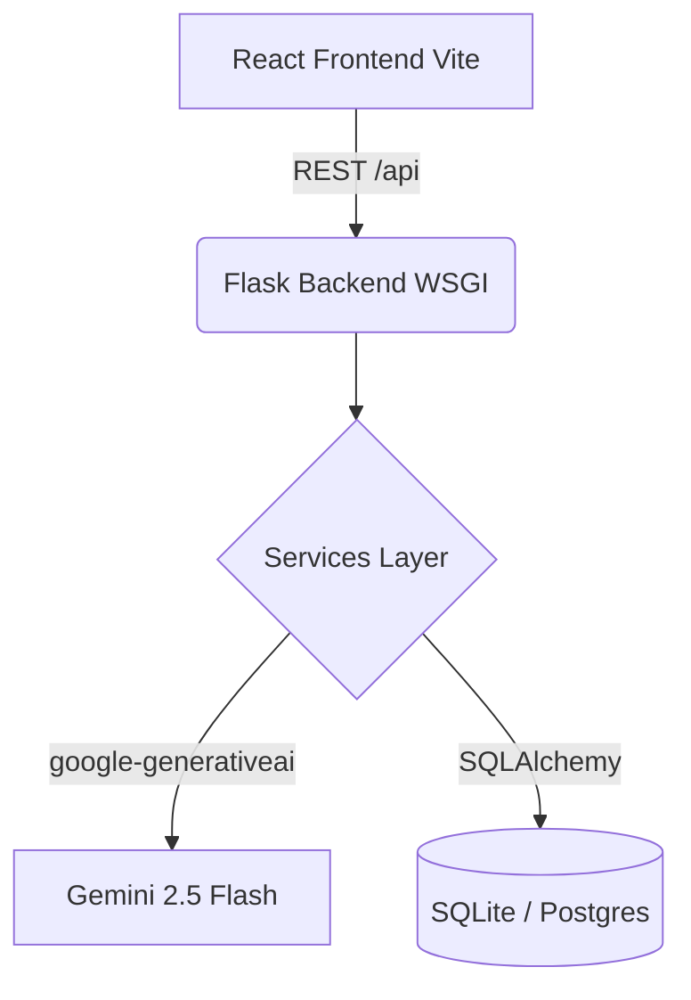

# EcoPilot Architecture

EcoPilot uses a decoupled, full-stack architecture designed for high availability and low latency carbon calculations.

## System Diagram

## Core Components
1. **Frontend**: React 18 + Vite. Hosted on Vercel. Communicates strictly via typed Axios payloads.
2. **Backend**: Python Flask Application Factory. Hosted on Render.
3. **Database**: SQLite for development, configured for PostgreSQL in production.
4. **AI Layer**: Google Gemini API, accessed securely via backend proxies to protect the API key.
